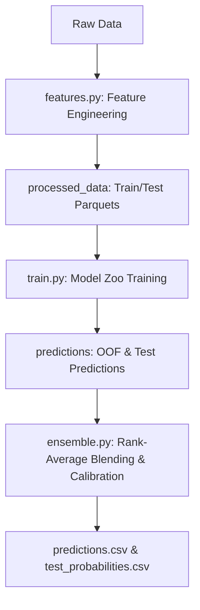

# FictiPay Churn Prediction: Handover Documentation

This document provides complete technical context, architectural details, and execution instructions for any Agentic IDE or developer taking over the FictiPay customer churn prediction pipeline.

---

## 1. Project Overview & Objective

- **Goal**: Predict customer churn for FictiPay (a mobile wallet).
- **Metric**: Rank-based **ROC-AUC** (primary) and **Brier Score** (for probability calibration quality).
- **Definitions**:
  - **Observation Window**: `2024-01-01` to `2024-03-31` (90 days).
  - **Prediction Window**: `2024-04-01` to `2024-04-30` (30 days).
  - **Churn Target**: `CHURN = 1` if a customer executes zero transactions in the prediction window; `CHURN = 0` otherwise.

---

## 2. Dataset Structure & Missing March Data Audit

The dataset resides in `bkash-presents-nsucec-datathon/public/`. 

### Schema & Files
1. **`train_labels.csv`**: Contains `ACCOUNT_ID` and `CHURN` labels for ~595,000 customers.
2. **`test.csv`**: Contains `ACCOUNT_ID` for ~255,000 test customers.
3. **`kyc.parquet`**: Customer metadata (demographics, region, account open date).
4. **`transactions/`**: Monthly transaction parquets:
   - `trx_2024-01.parquet`
   - `trx_2024-02.parquet`
   - *CRITICAL AUDIT*: March transactions are **completely missing** from the raw public dataset.
5. **`dayend_balance/`**: Daily wallet balance records for Jan, Feb, and March.
   - `dayend_balance_jan.parquet`
   - `dayend_balance_feb.parquet`
   - `dayend_balance_march.parquet` (provides crucial activity signal for the final observation month).

---

## 3. End-to-End Pipeline Architecture

The pipeline is organized into three decoupled, sequential steps orchestrated by `run_pipeline.py`.



### Step 1: Feature Engineering (`features.py`)
Generates 130 features across the following domains:
- **Demographics (KYC)**: One-hot encoded gender, region, and tenure (days since account open relative to March 31).
- **General Transactions (Jan & Feb)**: Counts, sums, averages, and standard deviations of inbound/outbound transactions.
- **Directional Recency**: Days since last outbound/inbound transaction, and days since specific transaction types (P2P, MerchantPay, BillPay, CashIn, CashOut).
- **March Wallet Balances**: Because March transactions are missing, March activity is captured via:
  - Final balance (March 31).
  - Balance drop (March 31 - March 1).
  - Balance trend (slope of daily balance over the 31 days).
  - Zero-balance days (days with balance < 10 TK).
  - Micro-windows: Mean balance and zero days in the last 7 days and 14 days of March.
- **Temporal Decay**: Activity decay rate between Jan-Feb, Feb-March, and Jan-March.

### Step 2: Model Zoo Training (`train.py`)
Trains five diverse base classifiers using **10-Fold Stratified Cross-Validation**:
1. **LightGBM**: Denser trees (max depth 8, num leaves 63) with balanced class weights.
2. **XGBoost**: Tree depth 7 with balanced weights, `early_stopping_rounds=100` to prevent overfitting, and `"tree_method": "hist"`.
3. **CatBoost** (Optional): GPU-enabled if installed; falls back gracefully.
4. **Random Forest**: Out-of-bag bagging baseline (150 trees, depth 12).
5. **Logistic Regression & MLP Classifier**: Trained on scaled, imputed features.

**GPU Acceleration Support**:
- Dynamically detects PyTorch CUDA availability.
- Automatically configures `"device": "cuda"` and `"tree_method": "hist"` for GPU platforms.
- Falls back safely to CPU execution using `n_jobs=-1` and `"tree_method": "hist"` (preventing deadlocks and CPU warning loops).

### Step 3: Rank-Average Blending & Calibration (`ensemble.py`)
Optimizes rank-based predictions and maps them to clean probabilities:
1. **Model Weights**: Base models are weighted by their OOF AUC squared:
   $$W_i = \frac{\text{AUC}_i^2}{\sum \text{AUC}_j^2}$$
2. **Rank Averaging**: Converts individual model test probabilities into rank percentiles (0 to 1) before averaging, directly preserving ROC-AUC ranking and removing calibration variance.
3. **Probability Calibration**: Uses **Isotonic Regression** on OOF ranks to map blended percentiles back to valid class probabilities.
4. **Cost-Sensitive Thresholding**: Computes optimal decision thresholds minimizing the Datathon's cost function ($5 \times \text{False Negative} + 1 \times \text{False Positive}$).

---

## 4. Diagnostics & Analytics

- **SHAP Analysis (`explain.py`)**: Computes SHAP values using tree explanners.
  - *Primary Insight*: Outbound transaction counts in Feb and March daily balance standard deviation/stability are the strongest predictors of churn.
- **Leakage Audit (`explain.py`)**: Benchmarks single-feature predictive power. No single feature exceeds `0.95 AUC`, verifying the absence of data leakage.
- **Customer Segmentation (`segment.py`)**: Uses an Autoencoder + K-Means ($K=3$) to cluster customers into:
  - *VIPs (Segment 0)*: High balance, zero churn.
  - *Mass Market (Segment 1)*: Low balance, 13.88% churn rate.
  - *Power Users (Segment 2)*: Moderate balance, high transaction counts, 7.50% churn rate.

---

## 5. Directory Structure & Ignored Files

```
.
├── bkash-presents-nsucec-datathon/   [Ignored - Raw Data]
├── processed_data/                   [Ignored - Engineered features Parquet files]
├── models/                           [Ignored - Serialized model pickle files]
├── predictions/                      [Ignored - Intermediate predictions parquet files]
├── plots/                            [Tracked - Diagnostic charts & logs]
│   ├── roc_curves.png
│   ├── segmentation.png
│   ├── shap_beeswarm.png
│   └── ...
├── .gitignore                        [Tracked - Ignore configurations]
├── features.py                       [Tracked - Feature engineering script]
├── train.py                          [Tracked - Training script]
├── ensemble.py                       [Tracked - Blending & Calibration script]
├── run_pipeline.py                   [Tracked - Pipeline Orchestrator]
├── explain.py                        [Tracked - SHAP & Leakage script]
├── segment.py                        [Tracked - Customer segmentation script]
├── Exploratory_Analysis.ipynb        [Tracked - Jupyter Notebook for EDA]
├── features.md                       [Tracked - Feature catalog]
├── report.tex                        [Tracked - LaTeX presentation report]
└── predictions.csv                   [Ignored - Final ensembled predictions]
```

---

## 6. Verification Run Results (1% Sample)

| Model | AUC | Brier Score |
|---|---|---|
| LightGBM | 0.97552 | 0.07689 |
| XGBoost | 0.97452 | 0.17792 |
| Random Forest | 0.96686 | 0.03468 |
| Logistic Regression | 0.97551 | 0.05278 |
| MLP Classifier | 0.96169 | 0.03426 |
| **Rank-Average Blend (Calibrated)** | **0.98334** | **0.03084** |
| Stacking (Calibrated) | 0.98202 | 0.03120 |

---

## 7. Next Steps & How to Run

To run training on a high-resource PC:
1. Ensure raw data is in `bkash-presents-nsucec-datathon/public/`.
2. Run the end-to-end pipeline:
   ```bash
   python3 run_pipeline.py
   ```
3. To view feature importances and run SHAP analysis:
   ```bash
   python3 explain.py
   ```
4. To run customer segmentation profiling:
   ```bash
   python3 segment.py
   ```
